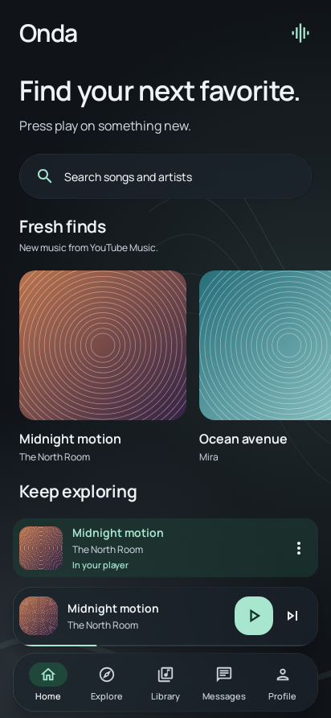
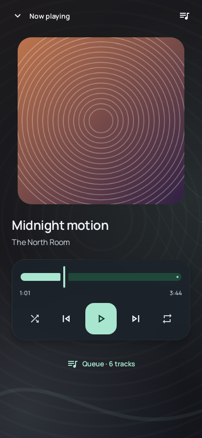

# Onda

Onda is a native Android application built around music as a social object.

## Status

Onda 0.3.0 adds a Liquid Glass-inspired native interface: an artwork discovery rail, glass search, floating navigation and mini-player, and one coherent full-player transport surface. Dark/light Manrope typography, adaptive labeled navigation at large font sizes, and persisted Full/Reduced/Minimal effects are included. Android 13+ non-low-memory devices use captured-backdrop blur; other devices have readable solid surfaces. Live YouTube Music search and Media3 background playback, seek, shuffle/repeat, queue editing and paused restoration remain connected. Authentication, library persistence, social features and messaging remain future milestones. This is a development preview; physical audio, background/headset behavior, TalkBack and frame/battery checks still need device verification. See [BUILD_REPORT.md](BUILD_REPORT.md) and [ROADMAP.md](ROADMAP.md).

Project folder: `C:/Users/laksh/OneDrive/Documents/ChatGPT/Onda`.

## UI preview

Production Compose components rendered on the host with offline test artwork and metadata. The app uses live provider results.

| Home | Player |
| --- | --- |
|  |  |

## Build

Use JDK 17 and Android SDK 35, including build-tools 35.0.0. Set `JAVA_HOME` and `ANDROID_HOME`, or set `sdk.dir` in ignored `local.properties`.

```powershell
.\gradlew.bat test :app:assembleDebug :app:lintDebug
```

Gradle 8.11.1 and dependencies are pinned. The SDK/AGP baseline is an initial reproducible development baseline, not a claim of meeting future Play release requirements. Review target SDK and dependencies before release.

This checkout also has ignored portable tools. Run `scripts/gradle-local.ps1 test :app:assembleDebug :app:lintDebug` to use them. For a fresh Windows checkout, `scripts/bootstrap-tools.ps1` downloads verified tools; pass `-AcceptAndroidLicense` only after reviewing and accepting [Android SDK terms](https://developer.android.com/studio/terms). The helper keeps the tools and Gradle cache within `.tools/`.

## Configuration

UI host renders and interaction/material checks use Robolectric with Roborazzi. Run `:app:testDebugUnitTest --tests '*LiquidGlassUiTest'`; PNGs appear in `app/build/reports/ui/` and CI's verification-reports artifact. Artwork/metadata in these renders are offline test fixtures; production uses the live provider.

The app uses NewPipeExtractor v0.26.5 through an isolated adapter; no API key is required. It is an unofficial integration, so upstream changes, region restrictions or unavailable tracks can cause explicit failures. Search is limited to songs; album, artist and playlist detail remain unsupported. Stream URLs are resolved just before playback and never saved in queue snapshots. The metadata-only demo is retained as a fixture and is not the production binding.

The optional Supabase factory is infrastructure only: no authentication or app configuration wiring exists yet. At the auth milestone, supply an HTTPS project URL and public publishable key through validated injected configuration; never add a service-role or secret key.

Live provider tests are separate from ordinary CI because they depend on the upstream service:

```powershell
$env:ONDA_LIVE_PROVIDER_TEST = 'true'
.\scripts\gradle-local.ps1 :data:music:test --tests '*YoutubeLiveSmokeTest'
Remove-Item Env:ONDA_LIVE_PROVIDER_TEST
```

## Engineering documents

The original user requirements are preserved in [docs/PRODUCT_BRIEF.md](docs/PRODUCT_BRIEF.md).

- [ARCHITECTURE.md](ARCHITECTURE.md): boundaries, music source, playback, social, messaging, offline behavior.
- [DATABASE.md](DATABASE.md): server schema plan, authorization, policy test matrix, local cache.
- [DESIGN_SYSTEM.md](DESIGN_SYSTEM.md): visual hierarchy, tokens, effects, accessibility.
- [RECOMMENDATIONS.md](RECOMMENDATIONS.md): transparent hybrid ranking, taste, privacy, tests.
- [ROADMAP.md](ROADMAP.md): phased scope and acceptance gates.

## Reference and ownership

Original Onda code is licensed under [GNU GPL version 3](LICENSE), as approved by the project owner. See [THIRD_PARTY_NOTICES.md](THIRD_PARTY_NOTICES.md) for dependency licenses and source. Each APK release links its corresponding source tag; license texts/notices are also packaged in the APK. LastWave is a reference project; no LastWave code, branding, assets or layouts are incorporated.
